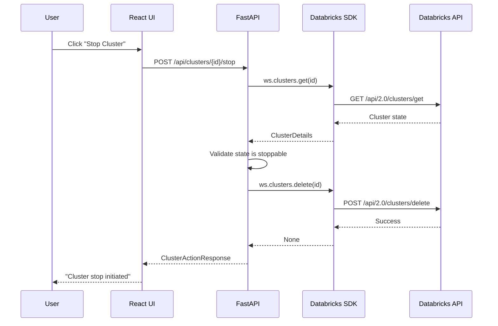
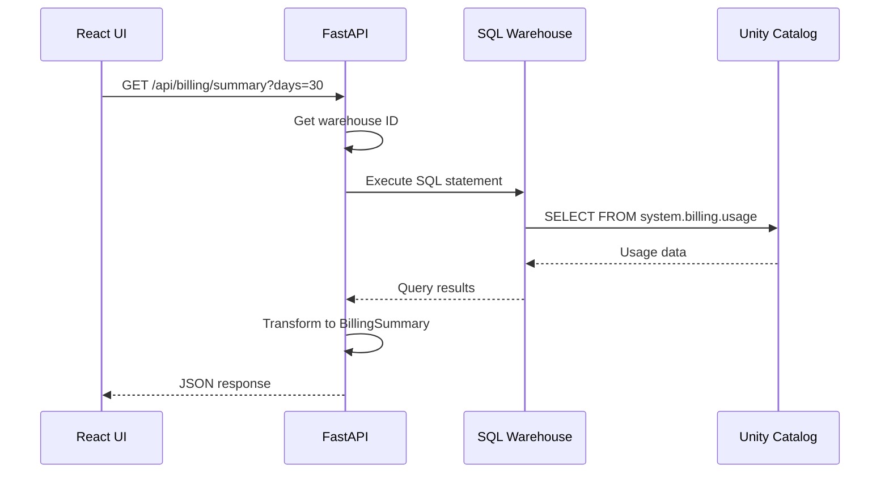

# Architecture Overview

## System Architecture

The Cluster Manager is a full-stack Databricks App built using the APX framework (FastAPI + React with TanStack Router).

```
┌─────────────────────────────────────────────────────────────────────────────┐
│                         Databricks Apps Platform                             │
├─────────────────────────────────────────────────────────────────────────────┤
│                                                                              │
│  ┌─────────────────────────────────────────────────────────────────────┐   │
│  │                      Cluster Manager App                             │   │
│  ├─────────────────────────────────────────────────────────────────────┤   │
│  │                                                                      │   │
│  │  ┌──────────────────┐              ┌──────────────────────────────┐ │   │
│  │  │    React UI      │   REST API   │      FastAPI Backend         │ │   │
│  │  │                  │◄────────────►│                              │ │   │
│  │  │  - TanStack      │              │  - Clusters Router           │ │   │
│  │  │    Router        │              │  - Billing Router            │ │   │
│  │  │  - TanStack      │              │  - Metrics Router            │ │   │
│  │  │    Query         │              │  - Policies Router           │ │   │
│  │  │  - Tailwind CSS  │              │  - Optimization Router       │ │   │
│  │  │  - shadcn/ui     │              │  - Workspace Router          │ │   │
│  │  │                  │              │                              │ │   │
│  │  └──────────────────┘              └──────────────┬───────────────┘ │   │
│  │                                                   │                  │   │
│  └───────────────────────────────────────────────────│──────────────────┘   │
│                                                      │                       │
│                                    ┌─────────────────▼─────────────────┐    │
│                                    │     Databricks Python SDK         │    │
│                                    │     (WorkspaceClient)             │    │
│                                    └─────────────────┬─────────────────┘    │
│                                                      │                       │
└──────────────────────────────────────────────────────│───────────────────────┘
                                                       │
         ┌─────────────────────────────────────────────┼──────────────────────────────┐
         │                                             │                               │
         ▼                                             ▼                               ▼
┌─────────────────────┐                  ┌─────────────────────────┐      ┌──────────────────┐
│  Databricks         │                  │   SQL Warehouse          │      │  Cluster         │
│  Clusters API       │                  │   Statement Execution    │      │  Policies API    │
│                     │                  │                          │      │                  │
│  - List clusters    │                  │  system.billing.usage    │      │  - List policies │
│  - Get cluster      │                  │  (Unity Catalog)         │      │  - Get policy    │
│  - Start cluster    │                  │                          │      │                  │
│  - Stop cluster     │                  └─────────────────────────┘      └──────────────────┘
│  - Cluster events   │
└─────────────────────┘
```

## Component Architecture

### Frontend (React)

```
cluster_manager/ui/
├── routes/                    # TanStack Router pages
│   ├── __root.tsx            # Root layout
│   ├── _sidebar.tsx          # Sidebar layout wrapper
│   └── _sidebar/
│       ├── index.tsx         # Dashboard home
│       ├── clusters/
│       │   ├── index.tsx     # Clusters list
│       │   └── $clusterId.tsx # Cluster detail
│       ├── analytics.tsx     # Billing analytics
│       ├── policies.tsx      # Policy management
│       └── recommendations.tsx # Optimization recommendations
├── components/
│   ├── ui/                   # shadcn/ui components
│   └── clusters/             # Domain-specific components
├── lib/
│   ├── api.ts               # Auto-generated API client (Orval)
│   └── utils.ts             # Utility functions
└── types/
    └── routeTree.gen.ts     # Auto-generated route types
```

### Backend (FastAPI)

```
cluster_manager/backend/
├── app.py                    # Application entry point
├── core.py                   # Core infrastructure
│   ├── AppConfig            # Pydantic settings
│   ├── create_app()         # FastAPI factory
│   ├── Dependency           # DI shortcuts
│   └── Static file serving  # SPA support
├── models.py                 # Pydantic response models
└── routers/
    ├── clusters.py          # Cluster CRUD operations
    ├── billing.py           # DBU billing queries
    ├── metrics.py           # Cluster metrics
    ├── policies.py          # Policy management
    ├── optimization.py      # Cost optimization analysis
    └── workspace.py         # Workspace info
```

## Data Flow

### Cluster Operations Flow



### Billing Data Flow



## Authentication Architecture

### Dual Authentication Strategy

The app uses a dual authentication strategy:

1. **Service Principal (SP) Authentication**
   - Used for cluster management operations
   - SP is added to workspace admins group
   - Provides consistent permissions regardless of user

2. **On-Behalf-Of (OBO) User Authentication**
   - Used for user-specific operations
   - Inherits user's workspace permissions
   - Accessed via `X-Forwarded-Access-Token` header

```python
# Service Principal client (from app.state)
def get_ws(request: Request) -> WorkspaceClient:
    return request.app.state.workspace_client

# User client with OBO token
def get_user_ws(
    request: Request,
    token: Annotated[str | None, Header(alias="X-Forwarded-Access-Token")] = None,
) -> WorkspaceClient:
    if token:
        return WorkspaceClient(token=token, auth_type="pat")
    return request.app.state.workspace_client  # Fallback
```

## State Management

### Frontend State (TanStack Query)

```typescript
// Query hooks with automatic caching
const { data: clusters } = useClusters();        // GET /api/clusters
const { data: metrics } = useMetricsSummary();   // GET /api/metrics/summary

// Mutation hooks with cache invalidation
const startCluster = useStartCluster();
await startCluster.mutateAsync({ clusterId });
// Automatically invalidates clusters query
```

### Backend State

- **Stateless API**: No server-side session state
- **Configuration**: Environment variables via `AppConfig`
- **Workspace Client**: Initialized at app startup, stored in `app.state`

## Security Model

### Safe Mode Design

The app implements "Safe Mode" to prevent accidental data loss:

| Operation | Allowed | Notes |
|-----------|---------|-------|
| List clusters | Yes | Read-only |
| View cluster details | Yes | Read-only |
| Start cluster | Yes | Reversible |
| Stop cluster | Yes | Config preserved |
| **Delete cluster** | **No** | Not exposed in UI |

### Permission Requirements

| Resource | Required Permission | Purpose |
|----------|---------------------|---------|
| Clusters | `CAN_MANAGE` | Start/stop operations |
| SQL Warehouses | `CAN_USE` | Billing queries |
| Unity Catalog | `USE CATALOG` | system.billing.usage |
| Cluster Policies | `CAN_USE` | View policies |

## Performance Considerations

### Backend Optimizations

1. **Pagination**: Cluster list limited to prevent memory issues
   ```python
   for i, cluster in enumerate(ws.clusters.list()):
       if i + 1 >= limit:
           break
   ```

2. **Serverless Warehouse Selection**: Prioritize running serverless warehouses
   ```python
   # Priority: Running serverless > Running regular > Stopped serverless
   ```

3. **Query Timeout Handling**: 60s timeout with graceful fallback

### Frontend Optimizations

1. **Suspense Boundaries**: Loading states with skeletons
2. **Query Caching**: TanStack Query with stale-while-revalidate
3. **Memoization**: Policy maps computed once per render cycle

## Error Handling

### Backend Error Strategy

```python
try:
    cluster = ws.clusters.get(cluster_id)
except Exception as e:
    error_type = type(e).__name__
    error_msg = str(e)
    logger.error(f"Failed: [{error_type}] {error_msg}")
    raise HTTPException(
        status_code=404,
        detail=f"Cluster not found: {cluster_id}. Error: {error_msg}"
    )
```

### Frontend Error Strategy

- TanStack Query handles retries automatically
- Error boundaries catch rendering errors
- Toast notifications for user feedback

## Deployment Architecture

```
┌─────────────────────────────────────────────────────────────┐
│                  Databricks Workspace                        │
├─────────────────────────────────────────────────────────────┤
│                                                              │
│  ┌─────────────────────────────────────────────────────┐   │
│  │              Databricks Asset Bundle                 │   │
│  │                                                      │   │
│  │  databricks.yml                                      │   │
│  │  ├── Bundle configuration                            │   │
│  │  ├── App resource definition                         │   │
│  │  └── Target environments (dev, prod)                 │   │
│  │                                                      │   │
│  │  app.yaml                                            │   │
│  │  ├── Runtime configuration                           │   │
│  │  ├── Environment variables                           │   │
│  │  └── OAuth scopes                                    │   │
│  │                                                      │   │
│  └──────────────────────┬──────────────────────────────┘   │
│                         │                                    │
│                         ▼                                    │
│  ┌─────────────────────────────────────────────────────┐   │
│  │              Serverless Compute                      │   │
│  │                                                      │   │
│  │  - FastAPI application (uvicorn)                     │   │
│  │  - Static frontend assets                            │   │
│  │  - Auto-scaling                                      │   │
│  │                                                      │   │
│  └─────────────────────────────────────────────────────┘   │
│                                                              │
└─────────────────────────────────────────────────────────────┘
```

## Technology Stack

| Layer | Technology | Purpose |
|-------|------------|---------|
| **Frontend** | React 18 | UI framework |
| | TanStack Router | Type-safe routing |
| | TanStack Query | Server state management |
| | Tailwind CSS | Styling |
| | shadcn/ui | Component library |
| | Vite | Build tool |
| **Backend** | FastAPI | API framework |
| | Pydantic | Data validation |
| | Databricks SDK | Workspace operations |
| **Infrastructure** | Databricks Apps | Hosting platform |
| | Databricks Asset Bundles | Deployment |
| | Unity Catalog | Billing data |
