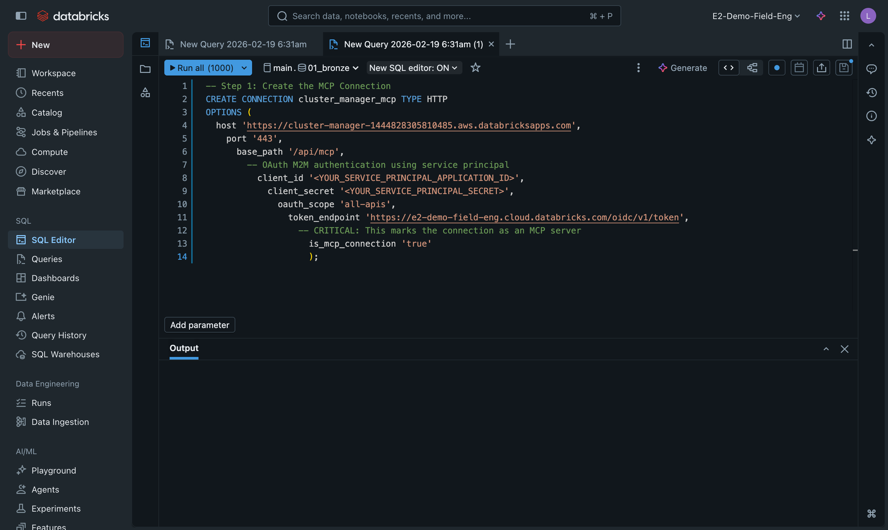
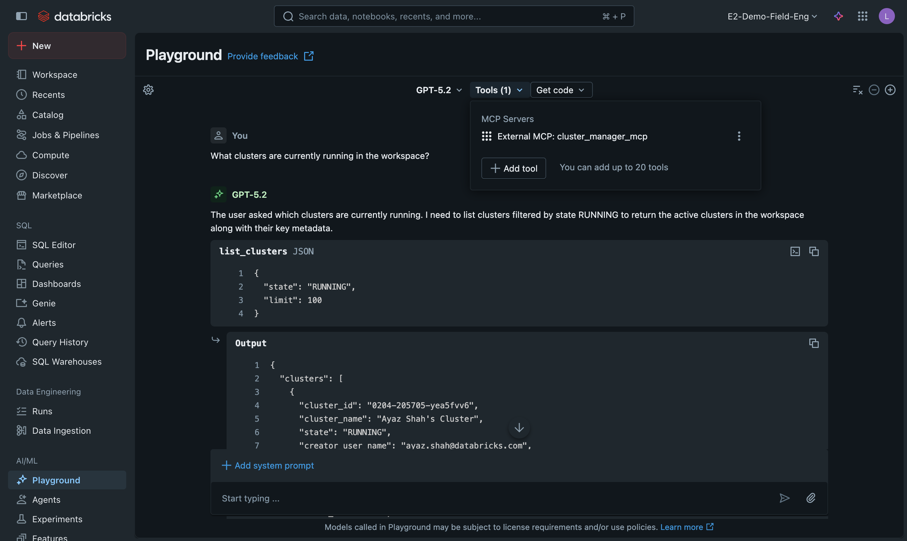

# Databricks Managed MCP Server Guide

This comprehensive guide explains how to transform a Databricks App into a managed MCP (Model Context Protocol) server, enabling AI agents in the Databricks AI Playground to interact with your application.

## Table of Contents

1. [Overview](#overview)
2. [Architecture](#architecture)
3. [Part 1: Developer Guide](#part-1-developer-guide)
   - [Prerequisites](#prerequisites)
   - [Dependencies](#dependencies)
   - [Creating the MCP Router](#creating-the-mcp-router)
   - [Defining MCP Tools](#defining-mcp-tools)
   - [Implementing Tool Execution](#implementing-tool-execution)
   - [Registering the Router](#registering-the-router)
   - [Security Considerations](#security-considerations)
4. [Part 2: Administrator Guide](#part-2-administrator-guide)
   - [Admin Prerequisites](#admin-prerequisites)
   - [Step 1: Get App Service Principal Info](#step-1-get-app-service-principal-info)
   - [Step 2: Create OAuth Secret](#step-2-create-oauth-secret)
   - [Step 3: Create Unity Catalog HTTP Connection](#step-3-create-unity-catalog-http-connection)
   - [Step 4: Test the Connection with SQL](#step-4-test-the-connection-with-sql)
   - [Step 5: Test with AI Playground](#step-5-test-with-ai-playground)
   - [Step 6: Create Supervisor Agent (Optional)](#step-6-create-supervisor-agent-optional)
5. [Troubleshooting](#troubleshooting)
6. [References](#references)

---

## Overview

The Model Context Protocol (MCP) is a JSON-RPC 2.0 based protocol that allows AI agents to discover and call tools exposed by servers. By adding MCP support to your Databricks App, you enable:

- **AI Playground Integration**: Users can chat with AI agents that call your app's functions
- **Supervisor Agents**: Build complex AI workflows using your app as a tool provider
- **Natural Language Access**: Users describe what they want, AI translates to API calls

## Architecture

```
┌─────────────────────────────────────────────────────────────────┐
│                    Databricks AI Playground                      │
│                    (or Supervisor Agent)                         │
└─────────────────────────────────┬───────────────────────────────┘
                                  │ JSON-RPC 2.0
                                  ▼
┌─────────────────────────────────────────────────────────────────┐
│               Unity Catalog HTTP Connection                      │
│         your_app_mcp (is_mcp_connection: 'true')                │
└─────────────────────────────────┬───────────────────────────────┘
                                  │ OAuth M2M
                                  ▼
┌─────────────────────────────────────────────────────────────────┐
│                      Your Databricks App                         │
│                      /api/mcp endpoint                           │
│  ┌─────────────────────────────────────────────────────────────┐│
│  │  MCP Tools: your_tool_1, your_tool_2, your_tool_3, ...     ││
│  └─────────────────────────────────────────────────────────────┘│
└─────────────────────────────────────────────────────────────────┘
```

---

# Part 1: Developer Guide

This section covers what developers need to know to add MCP support to an existing Databricks App.

## Prerequisites

- Existing Databricks App (FastAPI-based) deployed and running
- Python 3.10+
- Understanding of JSON-RPC 2.0 protocol basics

## Dependencies

No additional dependencies are required beyond what's already in a typical FastAPI app:

```toml
# pyproject.toml
[project]
dependencies = [
    "fastapi>=0.115.0",
    "pydantic>=2.0.0",
    "databricks-sdk>=0.40.0",
]
```

The MCP protocol is implemented using:
- **FastAPI** - HTTP endpoint handling
- **Pydantic** - Request/response validation
- **Standard library** - `json` for serialization

## Creating the MCP Router

Create a new file `routers/mcp.py` with the MCP JSON-RPC 2.0 endpoint:

```python
"""MCP (Model Context Protocol) JSON-RPC 2.0 endpoint."""

import json
from typing import Any

from fastapi import APIRouter, HTTPException
from pydantic import BaseModel, Field

from ..core import Dependency, logger

router = APIRouter(prefix="/api/mcp", tags=["mcp"])

# --- MCP Protocol Models ---

class JsonRpcRequest(BaseModel):
    """JSON-RPC 2.0 request."""
    jsonrpc: str = Field(default="2.0", description="JSON-RPC version")
    method: str = Field(..., description="Method to call")
    params: dict[str, Any] | None = Field(default=None, description="Method parameters")
    id: int | str | None = Field(default=None, description="Request ID")


class JsonRpcError(BaseModel):
    """JSON-RPC 2.0 error object."""
    code: int
    message: str
    data: Any | None = None


class JsonRpcResponse(BaseModel):
    """JSON-RPC 2.0 response."""
    jsonrpc: str = "2.0"
    result: Any | None = None
    error: JsonRpcError | None = None
    id: int | str | None = None
```

## Defining MCP Tools

Tools are the functions your app exposes to AI agents. **Tool descriptions are critical** - they determine how well AI routes user requests to the correct tool.

### Tool Definition Structure

```python
MCP_TOOLS = [
    {
        "name": "tool_name",
        "description": "...",  # CRITICAL - see format below
        "inputSchema": {
            "type": "object",
            "properties": {...},
            "required": [...]
        }
    },
]
```

### The 4-Section Description Format

AI agents route requests based on tool descriptions. Use this structured format for best results:

```python
{
    "name": "list_items",
    "description": (
        "ACTION VERB + PURPOSE - Brief summary of what this tool does. "
        "\n\n"
        "RETURNS: List specific fields returned by this tool. Be explicit - "
        "this helps AI understand what data it will get. "
        "\n\n"
        "USE THIS TOOL WHEN USER ASKS: "
        "'Example question 1', 'Example question 2', 'Example question 3', "
        "'Example question 4', 'Example question 5' (include 10+ variations). "
        "\n\n"
        "DO NOT USE FOR: Clarify what this tool should NOT be used for. "
        "Reference other tools (e.g., 'use get_item instead for single item details'). "
        "\n\n"
        "TIP: Optional usage hints for better results."
    ),
    "inputSchema": {...}
}
```

### Real Example from Cluster Manager

```python
{
    "name": "list_clusters",
    "description": (
        "LIST AND SEARCH CLUSTERS - Get an overview of all Databricks clusters. "
        "\n\n"
        "RETURNS: Array of clusters with: cluster_id, cluster_name, state "
        "(RUNNING/TERMINATED/PENDING/ERROR), creator_user_name, node_type_id, "
        "num_workers, spark_version, uptime_minutes, estimated_dbu_per_hour. "
        "\n\n"
        "USE THIS TOOL WHEN USER ASKS: "
        "'Show me all clusters', 'What clusters are running?', "
        "'List terminated clusters', 'How many clusters do we have?', "
        "'Which clusters are using the most DBUs?', 'Find clusters owned by X', "
        "'Show idle clusters', 'What's the cluster status?', "
        "'Are there any clusters in error state?'. "
        "\n\n"
        "DO NOT USE FOR: Getting detailed config of ONE cluster (use get_cluster), "
        "or taking actions (use start_cluster/stop_cluster). "
        "\n\n"
        "TIP: Filter by state='RUNNING' for active clusters."
    ),
    "inputSchema": {
        "type": "object",
        "properties": {
            "state": {
                "type": "string",
                "description": "Filter by state. RUNNING=active, TERMINATED=stopped.",
                "enum": ["RUNNING", "TERMINATED", "PENDING", "ERROR"]
            },
            "limit": {
                "type": "integer",
                "description": "Max clusters to return (default 100).",
                "default": 100
            }
        }
    }
}
```

### Input Schema Patterns

**Required parameter:**
```python
"inputSchema": {
    "type": "object",
    "properties": {
        "item_id": {"type": "string", "description": "The unique item ID"}
    },
    "required": ["item_id"]
}
```

**Optional with default:**
```python
"inputSchema": {
    "type": "object",
    "properties": {
        "limit": {
            "type": "integer",
            "description": "Max items to return",
            "default": 100,
            "minimum": 1,
            "maximum": 500
        }
    }
}
```

**Enum values:**
```python
"inputSchema": {
    "type": "object",
    "properties": {
        "status": {
            "type": "string",
            "description": "Filter by status",
            "enum": ["ACTIVE", "PENDING", "COMPLETED"]
        }
    }
}
```

## Implementing Tool Execution

Connect MCP tools to your existing router functions:

```python
# Server metadata
SERVER_INFO = {
    "name": "your-app-mcp",
    "version": "1.0.0",
    "description": "Your app description",
}


async def execute_tool(
    tool_name: str,
    arguments: dict[str, Any],
    ws: Dependency.Client,
) -> dict[str, Any]:
    """Execute an MCP tool by calling existing functions."""
    logger.info(f"MCP executing tool: {tool_name} with args: {arguments}")

    if tool_name == "list_items":
        from .items import list_items
        result = list_items(ws, arguments.get("status"), arguments.get("limit", 100))
        return {"items": [r.model_dump(mode="json") for r in result], "count": len(result)}

    elif tool_name == "get_item":
        from .items import get_item
        item = get_item(arguments["item_id"], ws)
        return item.model_dump(mode="json")

    # Add more tools...

    raise ValueError(f"Unknown tool: {tool_name}")
```

## MCP Protocol Handlers

Implement the three required MCP methods:

```python
def _handle_initialize(request: JsonRpcRequest) -> JsonRpcResponse:
    """Handle MCP initialize method."""
    return JsonRpcResponse(
        id=request.id,
        result={
            "protocolVersion": "2024-11-05",
            "capabilities": {"tools": {}},
            "serverInfo": SERVER_INFO,
        },
    )


def _handle_tools_list(request: JsonRpcRequest) -> JsonRpcResponse:
    """Handle MCP tools/list method."""
    return JsonRpcResponse(id=request.id, result={"tools": MCP_TOOLS})


async def _handle_tools_call(request: JsonRpcRequest, ws) -> JsonRpcResponse:
    """Handle MCP tools/call method."""
    params = request.params or {}
    tool_name = params.get("name")
    arguments = params.get("arguments", {})

    if not tool_name:
        return JsonRpcResponse(
            id=request.id,
            error=JsonRpcError(code=-32602, message="Invalid params: 'name' is required"),
        )

    try:
        result = await execute_tool(tool_name, arguments, ws)
        return JsonRpcResponse(
            id=request.id,
            result={"content": [{"type": "text", "text": json.dumps(result, indent=2, default=str)}]},
        )
    except Exception as e:
        logger.exception(f"MCP tool call failed: {tool_name}")
        return JsonRpcResponse(
            id=request.id,
            error=JsonRpcError(code=-32000, message=str(e)),
        )


# Main endpoint
@router.post("", response_model=JsonRpcResponse)
async def mcp_handler(request: JsonRpcRequest, ws: Dependency.Client) -> JsonRpcResponse:
    """MCP JSON-RPC 2.0 endpoint."""
    logger.info(f"MCP request: method={request.method}, id={request.id}")

    if request.jsonrpc != "2.0":
        return JsonRpcResponse(
            id=request.id,
            error=JsonRpcError(code=-32600, message=f"Invalid JSON-RPC version: {request.jsonrpc}"),
        )

    if request.method == "initialize":
        return _handle_initialize(request)
    elif request.method == "tools/list":
        return _handle_tools_list(request)
    elif request.method == "tools/call":
        return await _handle_tools_call(request, ws)

    return JsonRpcResponse(
        id=request.id,
        error=JsonRpcError(code=-32601, message=f"Method not found: {request.method}"),
    )


# Optional: REST endpoints for debugging
@router.get("/tools")
async def list_tools():
    """List available MCP tools (REST endpoint for debugging)."""
    return {"tools": MCP_TOOLS, "server": SERVER_INFO}


@router.get("/health")
async def mcp_health():
    """MCP endpoint health check."""
    return {"status": "healthy", "server": SERVER_INFO, "protocol_version": "2024-11-05"}
```

## Registering the Router

### Update `routers/__init__.py`:

```python
from .mcp import router as mcp_router

__all__ = [
    # ... existing routers
    "mcp_router",
]
```

### Update `app.py`:

```python
from .routers import mcp_router, ...

app = create_app(
    routers=[
        # ... existing routers
        mcp_router,
    ]
)
```

## Security Considerations

### 1. Service Principal Authentication

The MCP endpoint uses your app's Service Principal for authentication. Ensure the SP has only the necessary permissions:

```python
# The workspace client (ws) comes from your app's SP authentication
# It has whatever permissions were granted to the SP
```

### 2. Safe Operations Only

Consider exposing only safe operations. For example, this app exposes:
- ✅ Start/Stop clusters (preserves configuration)
- ❌ Terminate/Delete clusters (destructive)

### 3. Input Validation

Always validate tool inputs before executing:

```python
async def _start_cluster(ws, args: dict) -> dict:
    cluster_id = args.get("cluster_id")
    if not cluster_id:
        raise ValueError("cluster_id is required")
    # Additional validation...
```

### 4. Audit Logging

Log all MCP tool executions for audit trails:

```python
logger.info(f"MCP executing tool: {tool_name} with args: {arguments}")
```

---

# Part 2: Administrator Guide

This section covers Databricks workspace configuration to enable AI agents to use your MCP server.

## Admin Prerequisites

1. Databricks App deployed and running
2. Unity Catalog enabled workspace
3. Workspace admin or connection creation privileges

## Step 1: Get App Service Principal Info

Get your app's service principal details:

```bash
databricks apps get <your-app-name>
```

Note these values from the output:
- `service_principal_client_id` - The SP's client ID (used as client_id in connection)
- `service_principal_id` - The numeric SP ID (used for creating secrets)
- `url` - Your app's URL (used as host in connection)

Example output:
```json
{
  "name": "cluster-manager",
  "service_principal_client_id": "515368c1-a40e-482c-89da-246833cf0f26",
  "service_principal_id": 77802625334619,
  "url": "https://cluster-manager-1444828305810485.aws.databricksapps.com"
}
```

## Step 2: Create OAuth Secret

Create an OAuth secret for the app's service principal:

```bash
# Using Databricks CLI
databricks api post /api/2.0/accounts/servicePrincipals/<SERVICE_PRINCIPAL_ID>/credentials/secrets --json '{}'
```

**Important**: Save the returned `secret` value securely - you'll need it for the connection and it cannot be retrieved again.

## Step 3: Create Unity Catalog HTTP Connection

Run this SQL in your Databricks workspace SQL Editor to create the MCP connection:



```sql
-- Create the MCP connection
CREATE CONNECTION your_app_mcp TYPE HTTP
OPTIONS (
  host 'https://your-app-url.aws.databricksapps.com',
  port '443',
  base_path '/api/mcp',
  -- OAuth M2M authentication using service principal
  client_id '<SERVICE_PRINCIPAL_CLIENT_ID>',
  client_secret '<YOUR_OAUTH_SECRET>',
  oauth_scope 'all-apis',
  token_endpoint 'https://<YOUR_WORKSPACE>.cloud.databricks.com/oidc/v1/token',
  -- CRITICAL: This marks the connection as an MCP server
  is_mcp_connection 'true'
);
```

**Replace these placeholders:**
| Placeholder | Source |
|-------------|--------|
| `your_app_mcp` | Choose a name for your connection |
| `your-app-url` | From `databricks apps get` output (`url` field) |
| `<SERVICE_PRINCIPAL_CLIENT_ID>` | From `databricks apps get` output |
| `<YOUR_OAUTH_SECRET>` | From Step 2 |
| `<YOUR_WORKSPACE>` | Your workspace hostname |

### Grant Access (Optional)

If other users/service principals need to use this connection:

```sql
GRANT USE CONNECTION ON your_app_mcp TO `user@company.com`;
-- or
GRANT USE CONNECTION ON your_app_mcp TO `service_principal_name`;
```

## Step 4: Test the Connection with SQL

Verify the MCP connection works:

```sql
-- Test tools/list method
SELECT http_request(
  conn => 'your_app_mcp',
  method => 'POST',
  path => '',
  json => '{"jsonrpc":"2.0","method":"tools/list","id":1}'
);

-- Test initialize method
SELECT http_request(
  conn => 'your_app_mcp',
  method => 'POST',
  path => '',
  json => '{"jsonrpc":"2.0","method":"initialize","id":2}'
);

-- Test a specific tool
SELECT http_request(
  conn => 'your_app_mcp',
  method => 'POST',
  path => '',
  json => '{"jsonrpc":"2.0","method":"tools/call","params":{"name":"list_clusters","arguments":{"limit":5}},"id":3}'
);
```

## Step 5: Test with AI Playground

The AI Playground provides an interactive way to test your MCP tools before building agents.

### 5.1: Navigate to AI Playground

1. Open your Databricks workspace
2. In the left sidebar, expand **AI/ML**
3. Click **Playground**

### 5.2: Add Your MCP Server

1. Click the **Tools** button in the toolbar to open the Add tools dialog

   

2. Click on the **MCP Servers** tab

   

3. Under **External MCP Servers**, find **Unity Catalog Connection**

4. Click the dropdown and search for your connection name

   

5. Select your connection and click **Save**

6. Verify the MCP server appears in the Tools panel

   

### 5.3: Verify Tools Are Loaded

Click on your MCP server name in the Tools panel to expand it. You should see your available tools listed.

**If no tools appear:**
- Check that your app is running: `databricks apps get <app-name>`
- Verify the connection is correctly configured
- Check app logs for errors

### 5.4: Test with Natural Language

Type questions that should trigger your tools:

| Question | Expected Tool |
|----------|---------------|
| "Show me all clusters" | `list_clusters` |
| "What clusters are running?" | `list_clusters` with state filter |
| "Get details for cluster abc-123" | `get_cluster` |
| "Start the dev cluster" | `start_cluster` |
| "What policies are available?" | `list_policies` |

### 5.5: Example Successful Interaction

Here's what a successful test looks like:


The AI:
1. Selects the correct tool
2. Passes appropriate arguments
3. Returns formatted results

### 5.6: Validation Checklist

```
- [ ] AI Playground is accessible
- [ ] MCP Server added successfully (shows green status)
- [ ] All tools appear when expanding the MCP server
- [ ] Simple list query returns expected data
- [ ] Filtered queries apply correct arguments
- [ ] Get single item queries work with valid IDs
- [ ] Error handling works for invalid IDs
- [ ] Action tools (start/stop) work correctly
```

## Step 6: Create Supervisor Agent (Optional)

For production use, create a Supervisor Agent that routes to your MCP server:

```python
# Using the manage_mas tool or SDK
manage_mas(
    action="create_or_update",
    name="Your Assistant",
    agents=[
        {
            "name": "your_app",
            "connection_name": "your_app_mcp",
            "description": (
                "Detailed description of what this agent does. Be specific about "
                "capabilities: list items, get item details, create items, etc. "
                "Include example questions users might ask."
            )
        }
    ],
    description="Assistant for managing your domain",
    instructions="""
    You are an assistant that helps users with [your domain].

    When users ask about items, use the your_app agent to:
    - List items: "list_items" tool
    - Get details: "get_item" tool with item_id
    - Create items: "create_item" tool

    Always confirm destructive actions with the user before executing.
    """
)
```

---

## Troubleshooting

### Connection Test Fails

| Error | Cause | Solution |
|-------|-------|----------|
| 401 Unauthorized | Invalid OAuth credentials | Verify client_id and client_secret |
| Connection refused | App not running | Start the app: `databricks apps start <app>` |
| Timeout | App slow or unresponsive | Check app logs and performance |
| "Method not found" | Incorrect base_path | Ensure base_path is `/api/mcp` |

### MCP Server Not Appearing in Playground

1. Verify the connection has `is_mcp_connection = 'true'`
2. Check you have USE CONNECTION permission
3. Try refreshing the Playground page

### Tool Not Found Errors

1. Verify tool name in `tools/call` matches exactly the name in `MCP_TOOLS`
2. Check tool is properly defined with all required fields
3. Look for typos in tool names

### Wrong Tool Selected by AI

1. Improve tool descriptions - be more specific
2. Add more example user requests in the "USE THIS TOOL WHEN" section
3. Clarify boundaries in the "DO NOT USE FOR" section

### Tool Execution Errors

Check app logs for detailed error messages:

```bash
databricks apps get <app-name>
# Check recent logs in the output
```

---

## References

- [Model Context Protocol Specification](https://modelcontextprotocol.io)
- [Databricks Supervisor Agents Documentation](https://docs.databricks.com/en/generative-ai/agent-framework/supervisor-agents.html)
- [Unity Catalog Connections](https://docs.databricks.com/en/connect/unity-catalog/index.html)
- [Databricks Apps Documentation](https://docs.databricks.com/en/dev-tools/databricks-apps/index.html)
