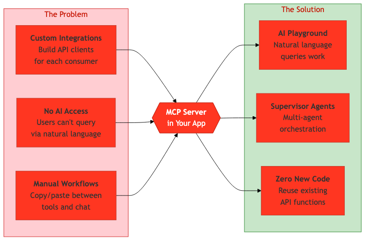
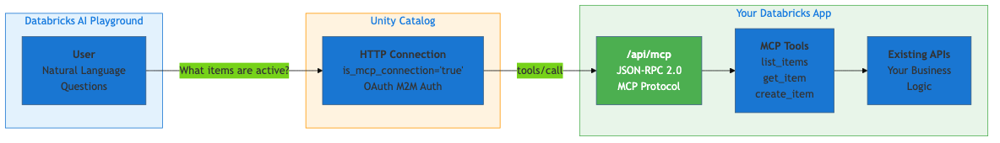
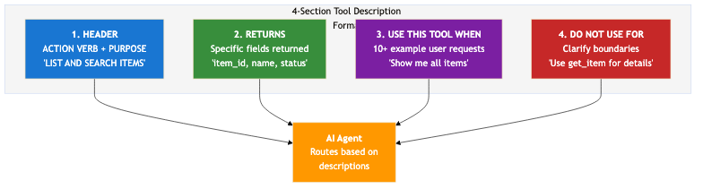

# How to Transform Your Databricks App into an AI-Powered MCP Server in 30 Minutes

*Turn any FastAPI application into a tool that AI agents can call using natural language — no ML expertise required*

---

## The AI Integration Problem Nobody Talks About

You've built a beautiful Databricks App. It has a clean REST API, a React frontend, and it does exactly what your team needs. But then someone asks: "Can we ask the AI to do this for us?"

Suddenly you're facing a wall of complexity. Custom integrations. API wrappers. Prompt engineering. Authentication flows. What should take an afternoon becomes a multi-sprint project.


*Adding AI capabilities to existing apps shouldn't require rebuilding everything*

Here's the thing: **your existing API functions are already the tools the AI needs**. You just need to expose them in a format AI agents understand.

This article shows you how we transformed a Databricks cluster management app into an AI-accessible service in under 30 minutes — and how you can do the same with any FastAPI application.

---

## What You'll Learn

**For Developers** — *15 min read*: How to add MCP (Model Context Protocol) support to any FastAPI app with zero new dependencies

**For Administrators** — *10 min read*: How to configure Unity Catalog connections and test with AI Playground

**For Everyone** — *5 min*: The "secret sauce" of tool descriptions that makes AI routing actually work

---

## The Architecture: Surprisingly Simple

Before diving into code, let's understand what we're building:


*Your existing app + 150 lines of code = AI-accessible service*

The magic happens through three components:

1. **MCP Router** — A JSON-RPC 2.0 endpoint (`/api/mcp`) that speaks the Model Context Protocol
2. **Unity Catalog Connection** — Registers your app as an "External MCP Server" with OAuth authentication
3. **AI Playground** — Where users interact with your tools using natural language

The best part? Your existing business logic stays exactly the same. The MCP router just wraps your current functions.

---

## Part 1: Developer Implementation

### No New Dependencies Required

If you're running a standard FastAPI app, you already have everything you need:

```toml
# pyproject.toml - these are likely already in your project
[project]
dependencies = [
    "fastapi>=0.115.0",
    "pydantic>=2.0.0",
    "databricks-sdk>=0.40.0",
]
```

### Step 1: Create the MCP Router

Create a new file `routers/mcp.py`. This is the heart of the integration:

```python
"""MCP (Model Context Protocol) JSON-RPC 2.0 endpoint."""

import json
from typing import Any
from fastapi import APIRouter, HTTPException
from pydantic import BaseModel, Field

from ..core import Dependency, logger

router = APIRouter(prefix="/api/mcp", tags=["mcp"])

# JSON-RPC 2.0 Protocol Models
class JsonRpcRequest(BaseModel):
    jsonrpc: str = Field(default="2.0")
    method: str
    params: dict[str, Any] | None = None
    id: int | str | None = None

class JsonRpcError(BaseModel):
    code: int
    message: str
    data: Any | None = None

class JsonRpcResponse(BaseModel):
    jsonrpc: str = "2.0"
    result: Any | None = None
    error: JsonRpcError | None = None
    id: int | str | None = None
```

### Step 2: Define Your Tools (This Is Where the Magic Happens)

Here's the critical insight that took us weeks to figure out: **AI agents route requests based entirely on tool descriptions**. A vague description means the AI won't know when to use your tool.


*The 4-section format that makes AI routing reliable*

Use this structured format for every tool:

```python
MCP_TOOLS = [
    {
        "name": "list_clusters",
        "description": (
            "LIST AND SEARCH CLUSTERS - Get an overview of all Databricks clusters. "
            "\n\n"
            "RETURNS: Array with: cluster_id, cluster_name, state (RUNNING/TERMINATED), "
            "creator_user_name, uptime_minutes, estimated_dbu_per_hour. "
            "\n\n"
            "USE THIS TOOL WHEN USER ASKS: "
            "'Show me all clusters', 'What clusters are running?', "
            "'List terminated clusters', 'How many clusters do we have?', "
            "'Which clusters are using the most DBUs?', 'Find idle clusters'. "
            "\n\n"
            "DO NOT USE FOR: Getting detailed config of ONE cluster (use get_cluster), "
            "or taking actions like start/stop (use start_cluster/stop_cluster)."
        ),
        "inputSchema": {
            "type": "object",
            "properties": {
                "state": {
                    "type": "string",
                    "description": "Filter by state. RUNNING=active, TERMINATED=stopped.",
                    "enum": ["RUNNING", "TERMINATED", "PENDING", "ERROR"]
                },
                "limit": {
                    "type": "integer",
                    "description": "Max clusters to return (default 100).",
                    "default": 100
                }
            }
        }
    },
]

SERVER_INFO = {
    "name": "cluster-manager-mcp",
    "version": "1.0.0",
    "description": "Databricks Cluster Manager - manage clusters via AI"
}
```

**The Description Sections:**
1. **HEADER** — Action verb + purpose (`LIST AND SEARCH CLUSTERS`)
2. **RETURNS** — Specific fields the AI will receive
3. **USE THIS TOOL WHEN** — 10+ example user requests (this is critical!)
4. **DO NOT USE FOR** — Clarify boundaries with other tools

### Step 3: Connect Tools to Your Existing Functions

This is where you reuse your existing code:

```python
async def execute_tool(tool_name: str, arguments: dict, ws) -> dict:
    """Execute MCP tool by calling existing router functions."""

    if tool_name == "list_clusters":
        from .clusters import list_clusters  # Your existing function!
        result = list_clusters(ws, arguments.get("state"), arguments.get("limit", 100))
        return {"clusters": [c.model_dump(mode="json") for c in result]}

    elif tool_name == "get_cluster":
        from .clusters import get_cluster
        return get_cluster(arguments["cluster_id"], ws).model_dump(mode="json")

    elif tool_name == "start_cluster":
        from .clusters import start_cluster
        return start_cluster(arguments["cluster_id"], ws).model_dump(mode="json")

    raise ValueError(f"Unknown tool: {tool_name}")
```

### Step 4: Implement the MCP Protocol Handlers

Three methods are required by the MCP protocol:

```python
@router.post("", response_model=JsonRpcResponse)
async def mcp_handler(request: JsonRpcRequest, ws: Dependency.Client) -> JsonRpcResponse:
    """Main MCP JSON-RPC 2.0 endpoint."""

    if request.method == "initialize":
        return JsonRpcResponse(
            id=request.id,
            result={
                "protocolVersion": "2024-11-05",
                "capabilities": {"tools": {}},
                "serverInfo": SERVER_INFO
            }
        )

    elif request.method == "tools/list":
        return JsonRpcResponse(id=request.id, result={"tools": MCP_TOOLS})

    elif request.method == "tools/call":
        params = request.params or {}
        tool_name = params.get("name")
        arguments = params.get("arguments", {})

        try:
            result = await execute_tool(tool_name, arguments, ws)
            return JsonRpcResponse(
                id=request.id,
                result={"content": [{"type": "text", "text": json.dumps(result, indent=2)}]}
            )
        except Exception as e:
            return JsonRpcResponse(
                id=request.id,
                error=JsonRpcError(code=-32000, message=str(e))
            )

    return JsonRpcResponse(
        id=request.id,
        error=JsonRpcError(code=-32601, message=f"Method not found: {request.method}")
    )


# Debugging endpoints (optional but helpful)
@router.get("/tools")
async def list_tools():
    return {"tools": MCP_TOOLS, "server": SERVER_INFO}

@router.get("/health")
async def health():
    return {"status": "healthy", "server": SERVER_INFO}
```

### Step 5: Register the Router

Update your `routers/__init__.py`:

```python
from .mcp import router as mcp_router

__all__ = ["mcp_router", ...]  # Add to existing exports
```

Update your `app.py`:

```python
from .routers import mcp_router

app = create_app(routers=[mcp_router, ...])  # Add to router list
```

**That's it for the code!** About 150 lines total, and most of it is boilerplate you can copy directly.

---

## Part 2: Administrator Configuration

Now let's make this accessible from AI Playground.

### Step 1: Deploy Your Updated App

```bash
# Build frontend (if applicable)
cd your_app/ui && npm run build

# Deploy to Databricks
cd ../..
databricks bundle deploy -t dev

# IMPORTANT: Trigger new deployment after bundle deploy
databricks apps deploy your-app-name \
  --source-code-path "/Workspace/Users/you@company.com/.bundle/your-app/dev/files"
```

### Step 2: Get Your App's Service Principal Info

```bash
databricks apps get your-app-name --output json
```

Note these values:
- `service_principal_client_id` — Used for OAuth
- `service_principal_id` — Used to create secrets
- `url` — Your app's URL

### Step 3: Create an OAuth Secret

```bash
databricks api post /api/2.0/accounts/servicePrincipals/<SP_ID>/credentials/secrets \
  --json '{}'
```

**Save the returned secret!** You can't retrieve it again.

### Step 4: Create the Unity Catalog Connection

Run this SQL in your Databricks SQL Editor:


*Creating the HTTP connection with MCP flag*

```sql
CREATE CONNECTION your_app_mcp TYPE HTTP
OPTIONS (
  host 'https://your-app-url.aws.databricksapps.com',
  port '443',
  base_path '/api/mcp',
  client_id '<SERVICE_PRINCIPAL_CLIENT_ID>',
  client_secret '<YOUR_OAUTH_SECRET>',
  oauth_scope 'all-apis',
  token_endpoint 'https://your-workspace.cloud.databricks.com/oidc/v1/token',
  is_mcp_connection 'true'  -- THIS IS THE CRITICAL FLAG
);
```

### Step 5: Test with SQL First

```sql
-- Verify tools are exposed
SELECT http_request(
  conn => 'your_app_mcp',
  method => 'POST',
  path => '',
  json => '{"jsonrpc":"2.0","method":"tools/list","id":1}'
);
```

---

## Part 3: Testing in AI Playground

This is the fun part — watching your app respond to natural language.

### Add Your MCP Server

1. Navigate to **AI/ML → Playground**
2. Click the **Tools** button


*The Tools button opens the configuration panel*

3. Click the **MCP Servers** tab


*Select MCP Servers to add external tools*

4. Under **Unity Catalog Connection**, find your connection


*Search for your connection name*

5. After adding, verify your tools appear


*Your MCP tools should now be listed*

### Test with Natural Language

Try asking questions like:
- "What clusters are currently running?"
- "Show me clusters that have been running for more than 24 hours"
- "Get details for cluster abc-123"


*The AI correctly identifies the tool and returns formatted results*

In this example, asking "What clusters are currently running?" correctly:
1. Selected the `list_clusters` tool
2. Applied the `state: "RUNNING"` filter
3. Returned 21 clusters with relevant details

---

## Common Gotchas (Save Yourself Hours)

### Gotcha 1: "My MCP server doesn't appear in Playground"

**Cause:** Missing `is_mcp_connection = 'true'` in your SQL

**Solution:** Verify your CREATE CONNECTION includes this exact option

### Gotcha 2: "curl returns empty response"

**Cause:** MCP endpoints require authentication

**Solution:** Test via browser (while logged in) or use SQL `http_request()`

### Gotcha 3: "AI picks the wrong tool"

**Cause:** Vague tool descriptions

**Solution:** Add more examples to "USE THIS TOOL WHEN" section (aim for 10+)

### Gotcha 4: "Tools not updated after code changes"

**Cause:** Bundle deploy doesn't trigger app restart

**Solution:** Run `databricks apps deploy` after `databricks bundle deploy`

---

## Try It Yourself: 3 Paths

### Path 1: Quick Exploration (5 min)
Browse our [complete implementation on GitHub](https://github.com/LaurentPRAT-DB/cluster-manager) — especially `routers/mcp.py`

### Path 2: Add to Existing App (30 min)
1. Copy the MCP router template
2. Define 2-3 tools wrapping your existing functions
3. Deploy and create UC connection
4. Test in Playground

### Path 3: Deep Dive
Read the full [MCP Server documentation](https://github.com/LaurentPRAT-DB/cluster-manager/blob/main/docs/MCP_SERVER.md) covering security, error handling, and Supervisor Agent integration

---

## Resources

- **GitHub Repository:** [cluster-manager](https://github.com/LaurentPRAT-DB/cluster-manager)
- **MCP Protocol Spec:** [modelcontextprotocol.io](https://modelcontextprotocol.io)
- **Databricks Apps Docs:** [Databricks Documentation](https://docs.databricks.com/en/dev-tools/databricks-apps/index.html)

---

## About the Author

*Laurent Prat is a Solutions Architect at Databricks, helping customers build AI-powered data applications. When not writing code, he's probably explaining why tool descriptions need 10+ examples.*

---

**Did this save you time?** Give it a clap and follow for more Databricks deep dives.

*Tags: #Databricks #MCP #AI #FastAPI #Python #LLM #AIAgents*
